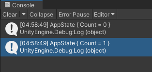
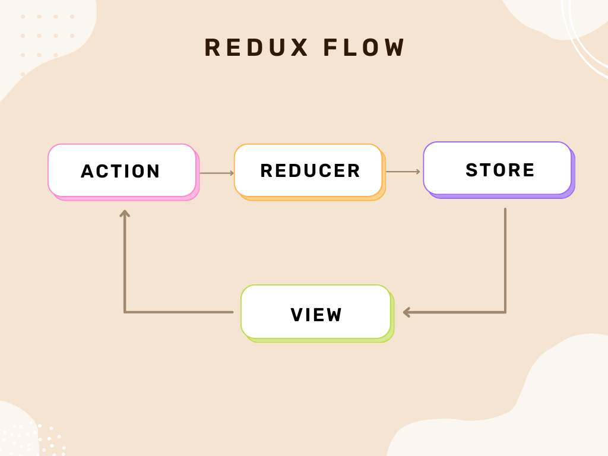
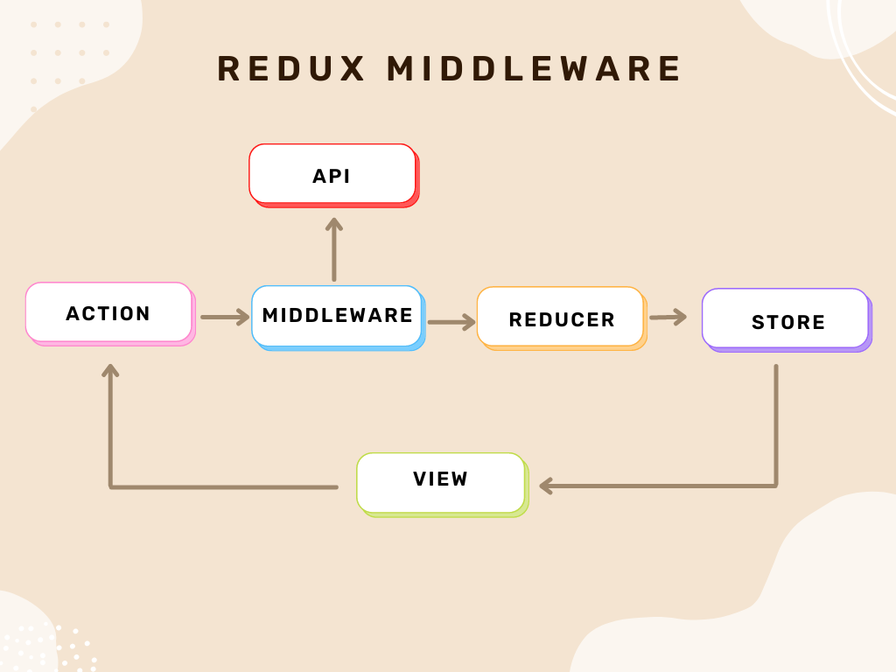
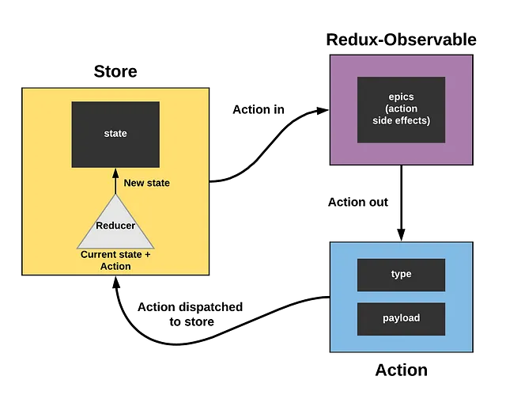
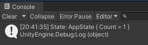

# Unity Redux Middleware

UnityReduxMiddleware provides middleware for adding logic processing to Unity.AppUI.Redux.
It can also be integrated with R3 to add processes that can be written in Rx.

[](LICENSE)

[日本語版 README](https://github.com/Garume/Unity-Redux-Middleware/blob/master/README_JA.md)

## Overview

Unity.AppUI.Redux is supposed to be based on a state management library developed in Javascript. However, AppUI.Redux does not have the middleware functionality of the original library. By using this middleware, it is possible to insert processing before and after dispatch.

This library adds this middleware to AppUI.Redux.

Note: This is not an explanation of AppUI.Redux.

## Table of Contents

<details>
<!-- START doctoc generated TOC please keep comment here to allow auto update -->
<!-- DON'T EDIT THIS SECTION, INSTEAD RE-RUN doctoc TO UPDATE -->


- [Setup](#setup)
  - [Requirements](#requirements)
  - [Installation](#installation)
- [Demonstration](#demonstration)
- [Middleware](#middleware)
  - [Concepts](#concepts)
  - [How to create Middleware](#how-to-create-middleware)
  - [Execution order](#execution-order)
  - [Exception Handling](#exception-handling)
  - [Asynchronous Processing](#asynchronous-processing)
  - [Tests](#tests)
- [Epic](#epic)
  - [Concepts](#concepts-1)
  - [Setup.](#setup)
  - [Demo](#demo)
  - [How to create Epic](#how-to-create-epic)
  - [Operators](#operators)
    - [OfAction](#ofaction)
    - [Dispatch](#dispatch)
  - [Combine](#combine)
- [Support UniTask](#support-unitask)

<!-- END doctoc generated TOC please keep comment here to allow auto update -->
</details>

## Setup

### Requirements

-   Unity 2022.3 or higher

### Installation

1. select Window > Package Manager
2. Select the "+" button > Add package from git URL
3. Enter the following URL

```
https://github.com/Garume/Unity-Redux-Middleware.git?path=/Assets/UnityReducMiddleware
```

Or open Packages/manifest.json and add the following to the dependencies block

```
{
    "dependencies": {
        "com.garume.unity-redux-middleware": "https://github.com/Garume/Unity-Redux-Middleware.git?path=/Assets/UnityReducMiddleware"
    }
}
```

## Demonstration

Create LoggerMiddleware that outputs logs before and after dispatch.

```cs
using UnityEngine;
using UnityReduxMiddleware;

public class LoggerMiddleware
{
    public static MiddlewareDelegate Create()
    {
        return store => next => async (action, token) =>
        {
            var appName = action.type.Split('/')[0]; // get appName from action.
            Debug.Log(store.GetState()[appName]); // log the current state.
            await next(action, token); // call the next middleware. If there is no next middleware, dispatch is called.
            Debug.Log(store.GetState()[appName]); // output the state after dispatch to the log.
        };
    }
}
```

Let's apply the LoggerMiddleware we created.

```cs
using Unity.AppUI.Redux;
using UnityReduxMiddleware;

public class Sample
{
    public void Main()
    {
        var store = new MiddlewareStore(); // Use MiddlewareStore instead of Store when using Middleware.
        store.AddMiddleware(LoggerMiddleware.Create()); // Add LoggerMiddleware.
        store.CreateSlice(Actions.AppName, new AppState(),.
            builder => builder.Add(Actions.Increment, IncrementReducer)); // Create the slice.

        store.Dispatch(Actions.IncrementAction.Invoke()); // dispatch the action.
    }


    public AppState IncrementReducer(AppState state, Action action)
    {
        return state with { Count = state.Count + 1 };
    }

    public record AppState
    {
        public int Count { get; set; }
    }

    public static class Actions
    {
        public const string AppName = "app";
        public const string Increment = AppName + "/Action1";
        public static readonly ActionCreator IncrementAction = Store.CreateAction(Increment);
    }
}
```

If you run this, you will get the following results. (It is recommended to run this using TestRunner.)



```
Debug.Log()
↓
dispatch // State is updated
↓
Debug.Log()
```

As a result, we were able to add processing before and after dispatch.

## Middleware

### Concepts

The Middleware design philosophy is based on the Redux philosophy.
Please check [Redux](https://www.infinijith.com/blog/redux/redux-middleware) for more information.

The following is a brief explanation.

Normal dispatch processing only passes the Action to the Reducer.


https://www.infinijith.com/blog/redux/redux-middleware

Adding Middleware allows for side effects and asynchronous processing between dispatch and Reducer. This allows logic to be confined to the domain layer.


https://www.infinijith.com/blog/redux/redux-middleware

In addition, the middleware is independent of each other and loosely coupled, making it easy to test.

### How to create Middleware

When creating Middleware, use `MiddlewareDelegate` as the return value.
Call `await(action,token)` in the delegate to proceed to the next Middleware.

```cs
public static MiddlewareDelegate Create()
{
    return store => next => async (action, token) =>
    {
        await next(action, token); // Call the next middleware.
    };
}
```

If there is no next middleware, it is dispatched using the current action and the State is updated.
Conditional branching can also be done by action.

For example, if you want to execute a process when the actionType is `"App/Increment"`, do the following.

```cs
public static MiddlewareDelegate Create()
{
    return store => next => async (action, token) =>
    {
        if (action.type == "App/Increment")
        {
            // Processing to be added
        }
        await next(action, token); // Call the next middleware.
    };
}
```

Do not forget to execute `await(action,token)` at this time.

### Execution order

You can add multiple pieces of middleware.

They are executed in the order in which they are added.

```cs
var store = new MiddlewareStore();
store.AddMiddleware(TestMiddleware1.Create());
store.AddMiddleware(TestMiddleware2.Create());
store.AddMiddleware(TestMiddleware3.Create());
...
```

For example, when added like this, the Action is passed as follows

```
TestMiddleware1
↓
TestMiddleware2
↓
TestMiddleware3
```

### Exception Handling

MiddlewareStore does not include try/catch middleware.

Instead, `ExceptionMiddleware`, a try/catch middleware, is included.

Basically, it is recommended to add this middleware first.

```cs
var store = new MiddlewareStore();
store.AddMiddleware(ExceptionMiddleware.Create());
store.AddMiddleware(TestMiddleware.Create());
...
```

The `ExceptionMiddleware` rethrows all exceptions except OperationCanceledException. If you prefer a different behavior, please create it accordingly.

### Asynchronous Processing

Middleware has a basic design that allows the use of Tasks for asynchronous processing.
Accordingly, an asynchronous method version of `Dispatch` is also provided.

```cs
void Dispatch(Action action)
void Dispatch(string actionType)
void Dispatch<T>(string actionType, T payload)
async Task DispatchAsync(Action action, CancellationToken token = default)
async Task DispatchAsync(string actionType, CancellationToken token = default)
async Task DispatchAsync<T>(string actionType, T payload, CancellationToken token = default)
```

### Tests

`Unity-Redux-Middleware/Assets/UnityReduxMiddleware/Tests/Runtime`.

## Epic

Epic allows Observable to be handled.

Note: R3 setup is required.

### Concepts

Refer to redux-observable.

Epic is a function that takes an Observable<Action> and returns an Observable<Action>.

In redux-observable, this is called "Actions in, actions out.


https://makeitnew.io/epic-reactive-programming-with-redux-observable-eff4d3fb952f

Epic's ability to handle Actions as streams allows for the use of a rich set of operators.
This makes it possible to easily write processes that would be difficult in middleware.

Also, unlike Middleware, Epic cannot insert processing before dispatch.
Instead, Epic itself can issue new Actions.

### Setup.

R3 setup is required.
Please refer to the following for installation.
https://github.com/Cysharp/R3?tab=readme-ov-file#unity

After successful installation, Epic features will be activated.

### Demo

First, let's create Epic that outputs a State when an Action is sent.

Since we also need a State to create Epic, we will also create an AppState.
Epic can be created from `Epic.Create<TState>()`.

```cs
public static Epic<AppState> CreateEpic()
    {
        return Epic.Create<AppState>((action, state) =>
        {
            return action.Do(_ => Debug.Log($"State: {state.CurrentValue}")); // Outputs the current State
        });
    }

    public record AppState
    {
        public int Count { get; set; }
    }
```

Next, create a MiddlewareStore that will use Epic.
At the same time, create EpicMiddleware to run Epic.
Unlike normal middleware, this middleware needs to be `Run` to be associated with Epic after it is added.

```cs
public void Main()
{
    var store = new MiddlewareStore();
    var epicMiddleware = EpicMiddleware.Default<AppState>(); // Create the epic middleware.
    store.CreateSlice("app", new AppState(), builder =>
    {
        builder.Add(Actions.Increment, IncrementReducer); // Tie the action type to the reducer.
    }); // Create a slice.
    store.AddMiddleware(epicMiddleware.Create()); // Add epic middleware.
    epicMiddleware.Run(CreateEpic()); // Run epic.
    Store.Dispatch(Actions.IncrementAction.Invoke()); // Dispatch the action.
}

public AppState IncrementReducer(AppState state, Action action)
{
    return state with { Count = state.Count + 1 };
}


public static class Actions
{
    public const string AppName = "app";
    public const string Increment = AppName + "/Increment";
    public const string IncrementRequest = AppName + "/IncrementRequest";
    public static readonly ActionCreator IncrementAction = Store.CreateAction(Increment);
}
```

If you run this, you should get the following results. (We recommend using TestRunner.)



Next, let's create an Epic that converts a specific Action`IncrementActionRequest` into an Action`IncrementAction` when it is received.
Epic can be combined, so use it as needed.

```cs

public void Main()
{
    var store = new MiddlewareStore();
    var epicMiddleware = EpicMiddleware.Default<AppState>(); // Create the epic middleware.
    store.CreateSlice("app", new AppState(), builder =>
    {
        builder.Add(Actions.Increment, IncrementReducer); // Tie the action type to the reducer.
    }); // Create a slice.
    store.AddMiddleware(epicMiddleware.Create()); // Add epic middleware.
    epicMiddleware.Run(CreateEpic()); // Run epic.

    store.Dispatch(Actions.IncrementRequest); // Dispatch the action.
    Debug.Log(store.GetState<AppState>(Actions.AppName)); // Log the result.
}


public static Epic<AppState> CreateEpic()
{
    var epic1 = Epic.Create<AppState>((action, state) =>
    {
        return action.Do(_ => Debug.Log($"State: {state.CurrentValue}"));
    });

    var epic2 = Epic.Create<AppState>((action, state) =>
    {
        return action.Where(x => x.type == Actions.IncrementRequest)
            .Select(_ => Actions.IncrementAction.Invoke());
    });

    return Epic.Combine(epic1, epic2);
}
```

If you run this, you will get the following results

! [alt text](docs/image-6.png)

### How to create Epic

To create Epic as usual, use the following.

```cs
Epic<TState> Epic.Create<TState>
Create<TState,TDependency> Epic.
```

Extension methods `string` and `ActionCreator` are provided for filtering by Action.
For example, you can write the following.

```cs
ActionCreator actionCreator = Store.CreateAction("App/Increment");
actionCreator.CreateEpic<AppState>((action, state) =>
{
    return action.Do(_ => Debug.Log($"State: {state.CurrentValue}")); // Execute only the Action of "App/Increment".
});

string actionType = "App/Increment";

actionType.CreateEpic<AppState>((action, state) =>
{
    return action.Do(_ => Debug.Log($"State: {state.CurrentValue}"));　// Execute only the Action of "App/Increment".
});
```

### Operators

We provide operators that are useful for adding processing.

#### OfAction

Only the Action passed as an argument is passed through.

#### Dispatch

Dispatch with the Action passed as argument.

### Combine

The following two methods are provided to combine Epic.

```cs
Epic.Combine<TState>()
Epicbuilder
```

Epicbuilder can be used as follows

```cs
private Epic<ApiMockState> RootEpic()
{
    var builder = Epic.CreateBuilder<ApiMockState>();

    Actions.SendRequest.CreateEpic<ApiMockState>((action, state) =>
        action.Do(Debug.Log).Dispatch(Actions.SendAction.Invoke("Requesting..."))
    ).AddTo(ref builder);

    Actions.SendRequest.CreateEpic<ApiMockState>((action, state) =>
        action.Delay(TimeSpan.FromSeconds(2))
            .Dispatch(Actions.SendAction.Invoke("Hello, Unity!"))
    ).AddTo(ref builder);


    return builder.Build();
}
```

## Support UniTask

UnityReduxMiddleware typically uses `Task` internally. However, there may be situations where you would prefer to use `UniTask`.

In such cases, simply incorporating UniTask into your project is sufficient. The middleware will automatically adjust its operations to return `UniTask`.
