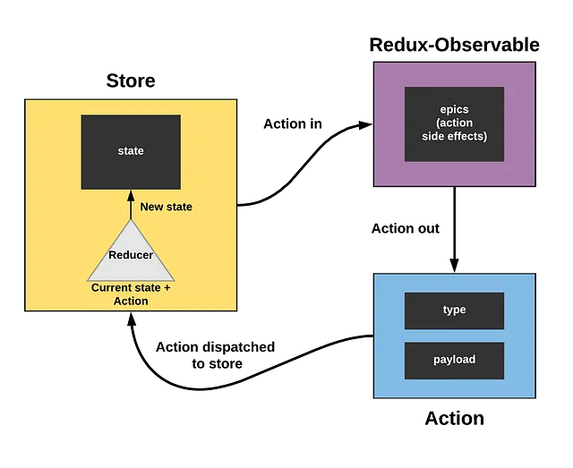

# Unity Redux Middleware

UnityReduxMiddleware は Unity.AppUI.Redux にロジック処理を追加するための Middleware を提供します。
R3 と連携することで Rx (Reactive Extensions) に書くことも可能です。

## 概要

Unity.AppUI.Redux は Javascript で開発されている状態管理ライブラリをもとに作成されていると思われます。しかしながら、AppUI.Redux には本家に搭載されている Middleware という機能がありません。この Middleware を利用することで dispatch の前後に処理を挟むことができます。

本ライブラリではこの Middleware を AppUI.Redux に追加します。

注: AppUI.Redux についての解説はしません。

## 目次

<details>
<!-- START doctoc generated TOC please keep comment here to allow auto update -->
<!-- DON'T EDIT THIS SECTION, INSTEAD RE-RUN doctoc TO UPDATE -->

-   [セットアップ](#%E3%82%BB%E3%83%83%E3%83%88%E3%82%A2%E3%83%83%E3%83%97)
    -   [要件](#%E8%A6%81%E4%BB%B6)
    -   [インストール](#%E3%82%A4%E3%83%B3%E3%82%B9%E3%83%88%E3%83%BC%E3%83%AB)
-   [デモ](#%E3%83%87%E3%83%A2)
-   [Middleware](#middleware)
    -   [概念](#%E6%A6%82%E5%BF%B5)
    -   [Middleware の作成方法](#middleware-%E3%81%AE%E4%BD%9C%E6%88%90%E6%96%B9%E6%B3%95)
    -   [実行順序](#%E5%AE%9F%E8%A1%8C%E9%A0%86%E5%BA%8F)
    -   [例外処理](#%E4%BE%8B%E5%A4%96%E5%87%A6%E7%90%86)
    -   [非同期処理](#%E9%9D%9E%E5%90%8C%E6%9C%9F%E5%87%A6%E7%90%86)
    -   [テスト](#%E3%83%86%E3%82%B9%E3%83%88)
-   [Epic](#epic)
    -   [概念](#%E6%A6%82%E5%BF%B5-1)
    -   [セットアップ](#%E3%82%BB%E3%83%83%E3%83%88%E3%82%A2%E3%83%83%E3%83%97-1)
    -   [デモ](#%E3%83%87%E3%83%A2-1)
    -   [Epic の作成方法](#epic-%E3%81%AE%E4%BD%9C%E6%88%90%E6%96%B9%E6%B3%95)
    -   [オペレータ](#%E3%82%AA%E3%83%9A%E3%83%AC%E3%83%BC%E3%82%BF)
        -   [OfAction](#ofaction)
        -   [Dispatch](#dispatch)
    -   [Combine](#combine)

<!-- END doctoc generated TOC please keep comment here to allow auto update -->
</details>

## セットアップ

### 要件

-   Unity 2022.3 以上

### インストール

1. Window > Package Manager を選択
2. 「+」ボタン > Add package from git URL を選択
3. 以下の URL を入力する

```
https://github.com/Garume/Unity-Redux-Middleware.git?path=/Assets/UnityReducMiddleware
```

あるいは Packages/manifest.json を開き、dependencies ブロックに以下を追記

```
{
    "dependencies": {
        "com.garume.unity-redux-middleware": "https://github.com/Garume/Unity-Redux-Middleware.git?path=/Assets/UnityReducMiddleware"
    }
}
```

## デモ

dispatch の前後にログを出力する LoggerMiddleware を作成します。

```cs
using UnityEngine;
using UnityReduxMiddleware;

public class LoggerMiddleware
{
    public static MiddlewareDelegate Create()
    {
        return store => next => async (action, token) =>
        {
            var appName = action.type.Split('/')[0]; // アプリ名をアクションから取得する。
            Debug.Log(store.GetState()[appName]); // 現在の状態をログに出力する。
            await next(action, token); // 次のミドルウェアを呼び出す。 次のミドルウェアがない場合はdispatchが呼ばれる。
            Debug.Log(store.GetState()[appName]); // dispatch後の状態をログに出力する。
        };
    }
}
```

作成した LoggerMiddleware を適用してみましょう。

```cs
using Unity.AppUI.Redux;
using UnityReduxMiddleware;

public class Sample
{
    public void Main()
    {
        var store = new MiddlewareStore(); // Middlewareを使用する際はStoreではなくMiddlewareStoreを使用する。
        store.AddMiddleware(LoggerMiddleware.Create()); // LoggerMiddlewareを追加する。
        store.CreateSlice(Actions.AppName, new AppState(),
            builder => builder.Add(Actions.Increment, IncrementReducer)); // スライスを作成する。

        store.Dispatch(Actions.IncrementAction.Invoke()); // アクションをディスパッチする。
    }

    public AppState IncrementReducer(AppState state, Action action)
    {
        return state with { Count = state.Count + 1 };
    }

    public record AppState
    {
        public int Count { get; set; }
    }

    public static class Actions
    {
        public const string AppName = "app";
        public const string Increment = AppName + "/Action1";
        public static readonly ActionCreator IncrementAction = Store.CreateAction(Increment);
    }
}
```

これを実行してみると以下のような結果が得られます。(TestRunner を用いて実行することを推奨します。)


```
Debug.Log()
↓
dispatch // 値が更新される
↓
Debug.Log()
```

結果として dispatch の前後に処理を追加することができました。

## Middleware

### 概念

Middleware の設計思想は Redux の思想に基づいています。
詳細に関しては[Redux](https://www.infinijith.com/blog/redux/redux-middleware)を確認してください。

以下簡単な説明です。

通常の dispatch 処理は Action を Reducer に渡すのみです。


https://www.infinijith.com/blog/redux/redux-middleware

Middleware を追加することで dispatch と Reducer の間での副作用や非同期処理を可能にします。これにより、ロジックをドメイン層に閉じ込めることが可能となります。


https://www.infinijith.com/blog/redux/redux-middleware

また、Middleware はそれぞれ独立したものとなっており疎結合であるためテストが容易です。

### Middleware の作成方法

Middleware を作成する際は`MiddlewareDelegate`を戻り値に使用してください。
デリゲート内で`await(action,token)`を呼ぶことで次の Middleware に進みます。

```cs
public static MiddlewareDelegate Create()
{
    return store => next => async (action, token) =>
    {
        await next(action, token); // 次のミドルウェアを呼び出す。
    };
}
```

次の Middleware がない場合現在の action を用いて dispatch され State が更新されます。
action により条件分岐させることもできます。

例えば、actionType が`"App/Increment"`である場合に処理を実行したいときは次のようにしてください。

```cs
public static MiddlewareDelegate Create()
{
    return store => next => async (action, token) =>
    {
        if (action.type == "App/Increment")
        {
            // 追加したい処理
        }
        await next(action, token); // 次のミドルウェアを呼び出す。
    };
}
```

この時`await(action,token)`を実行することを忘れないでください。

### 実行順序

Middleware は複数追加することが可能です。

また、追加した順に実行されていきます。

```cs
var store = new MiddlewareStore();
store.AddMiddleware(TestMiddleware1.Create());
store.AddMiddleware(TestMiddleware2.Create());
store.AddMiddleware(TestMiddleware3.Create());
...
```

例えばこのように追加したとき、Action は次のように渡されていきます。

```
TestMiddleware1
↓
TestMiddleware2
↓
TestMiddleware3
```

### 例外処理

MiddlewareStore には Middleware を try/catch する処理が含まれていません。

その代わりに、try/catch 用の Middleware である`ExceptionMiddleware`を同梱しています。

基本的にこの Middleware を最初に追加することを推奨します。

```cs
var store = new MiddlewareStore();
store.AddMiddleware(ExceptionMiddleware.Create());
store.AddMiddleware(TestMiddleware.Create());
...
```

`ExceptionMiddleware`は OperationCanceledException 以外の Exception を再スローするようになっています。違う挙動が良い場合は適宜作成してください。

### 非同期処理

Middleware は非同期処理用に Task を利用できる基本設計になっています。
これに応じて、`Dispatch`の非同期メソッド版も提供しています。

```cs
void Dispatch(Action action)
void Dispatch(string actionType)
void Dispatch<T>(string actionType, T payload)
async Task DispatchAsync(Action action, CancellationToken token = default)
async Task DispatchAsync(string actionType, CancellationToken token = default)
async Task DispatchAsync<T>(string actionType, T payload, CancellationToken token = default)
```

### テスト

`Unity-Redux-Middleware/Assets/UnityReduxMiddleware/Tests
/Runtime`を見てください。

## Epic

Epic を用いることで Observable が扱えるようになります。

注: R3 のセットアップが必要です。

### 概念

redux-observable を参考にしています。

Epic とは Observable<Action>を受け取り、Observable<Action>を返す関数のことを言います。

redux-observable ではこれを「Actions in, actions out.」と呼んでいます。


https://makeitnew.io/epic-reactive-programming-with-redux-observable-eff4d3fb952f

Epic は Action をストリームとして扱えるため豊富なオペレータを使用することができます。
これにより、Middleware では難しい処理も簡単に記述することが可能になります。

また、Epic は Middleware と異なり dispatch 前に処理を挿入することはできません。
その代わりに Epic 自身が新たに Action を発行することが可能です。

### セットアップ

R3 のセットアップが必須です。
以下を参考に導入してください。
https://github.com/Cysharp/R3?tab=readme-ov-file#unity

導入に成功すると Epic の機能が有効化されます。

### デモ

まずは Epic を作成してみましょう。
Action が送られてきたときに、State を出力するものを作成します。

Epic の作成には State も必要なので AppState も作成しておきます。
Epic は `Epic.Create<TState>()`から作成できます。

```cs
public static Epic<AppState> CreateEpic()
    {
        return Epic.Create<AppState>((action, state) =>
        {
            return action.Do(_ => Debug.Log($"State: {state.CurrentValue}")); // 現在のStateを出力
        });
    }

    public record AppState
    {
        public int Count { get; set; }
    }
```

次に Epic を使用する MiddlewareStore を作成します。
Epic を動作させるための EpicMiddleware も同時に作成します。
この Middleware は通常の Middleware と違い追加後に Epic と紐づけるために`Run`する必要があります。

```cs
public void Main()
{
    var store = new MiddlewareStore();
    var epicMiddleware = EpicMiddleware.Default<AppState>(); // エピックミドルウェアを作成する。
    store.CreateSlice("app", new AppState(), builder =>
    {
        builder.Add(Actions.Increment, IncrementReducer); // アクションタイプととリデューサーを紐づける。
    }); // スライスを作成する。
    store.AddMiddleware(epicMiddleware.Create()); // エピックミドルウェアを追加する。
    epicMiddleware.Run(CreateEpic()); // エピックを実行する。
    store.Dispatch(Actions.IncrementAction.Invoke()); // アクションをディスパッチする。
}

    public AppState IncrementReducer(AppState state, Action action)
    {
        return state with { Count = state.Count + 1 };
    }


    public static class Actions
    {
        public const string AppName = "app";
        public const string Increment = AppName + "/Increment";
        public const string IncrementRequest = AppName + "/IncrementRequest";
        public static readonly ActionCreator IncrementAction = Store.CreateAction(Increment);
    }
```

これを実行してみると以下の結果が得られるはずです。(TestRunner を用いることを推奨します。)


次に特定の Action`IncrementActionRequest`が送られてきたときに Action`IncrementAction`に変換する Epic を作成してみます。
Epic は Combine できるので適宜使用してください。

```cs

public void Main()
{
    var store = new MiddlewareStore();
    var epicMiddleware = EpicMiddleware.Default<AppState>(); // エピックミドルウェアを作成する。
    store.CreateSlice("app", new AppState(), builder =>
    {
        builder.Add(Actions.Increment, IncrementReducer); // アクションタイプととリデューサーを紐づける。
    }); // スライスを作成する。
    store.AddMiddleware(epicMiddleware.Create()); // エピックミドルウェアを追加する。
    epicMiddleware.Run(CreateEpic()); // エピックを実行する。

    store.Dispatch(Actions.IncrementRequest); // アクションをディスパッチする。
    Debug.Log(store.GetState<AppState>(Actions.AppName)); // 結果をログに出力する。
}

public static Epic<AppState> CreateEpic()
{
    var epic1 = Epic.Create<AppState>((action, state) =>
    {
        return action.Do(_ => Debug.Log($"State: {state.CurrentValue}"));
    });

    var epic2 = Epic.Create<AppState>((action, state) =>
    {
        return action.Where(x => x.type == Actions.IncrementRequest)
            .Select(_ => Actions.IncrementAction.Invoke());
    });

    return Epic.Combine(epic1, epic2);
}
```

これを実行してみると以下の結果を得ることができます。


### Epic の作成方法

通常通り作成する場合以下を利用してください。

```cs
Epic<TState> Epic.Create<TState>
Epic<TState,TDependency> Epic.Create<TState,TDependency>
```

Action でフィルターする用に`string`,`ActionCreator`の拡張メソッドを提供しています。
たとえば、以下のように書けます。

```cs
ActionCreator actionCreator = Store.CreateAction("App/Increment");
actionCreator.CreateEpic<AppState>((action, state) =>
{
    return action.Do(_ => Debug.Log($"State: {state.CurrentValue}")); // "App/Increment" のActionのみ実行
});

string actionType = "App/Increment";

actionType.CreateEpic<AppState>((action, state) =>
{
    return action.Do(_ => Debug.Log($"State: {state.CurrentValue}"));　// "App/Increment" のActionのみ実行
});
```

### オペレータ

処理を追加する際に便利なオペレータを提供しています。

#### OfAction

引数に渡した Action のみ通します。

#### Dispatch

引数に渡した Action で dispatch します。

### Combine

Epic を結合するために以下の二種類の方法を提供しています。

```cs
Epic.Combine<TState>()
Epicbuilder
```

Epicbuilder は以下のように使用できます。

```cs
private Epic<ApiMockState> RootEpic()
{
    var builder = Epic.CreateBuilder<ApiMockState>();

    Actions.SendRequest.CreateEpic<ApiMockState>((action, state) =>
        action.Do(Debug.Log).Dispatch(Actions.SendAction.Invoke("Requesting..."))
    ).AddTo(ref builder);

    Actions.SendRequest.CreateEpic<ApiMockState>((action, state) =>
        action.Delay(TimeSpan.FromSeconds(2))
            .Dispatch(Actions.SendAction.Invoke("Hello, Unity!"))
    ).AddTo(ref builder);


    return builder.Build();
}
```
